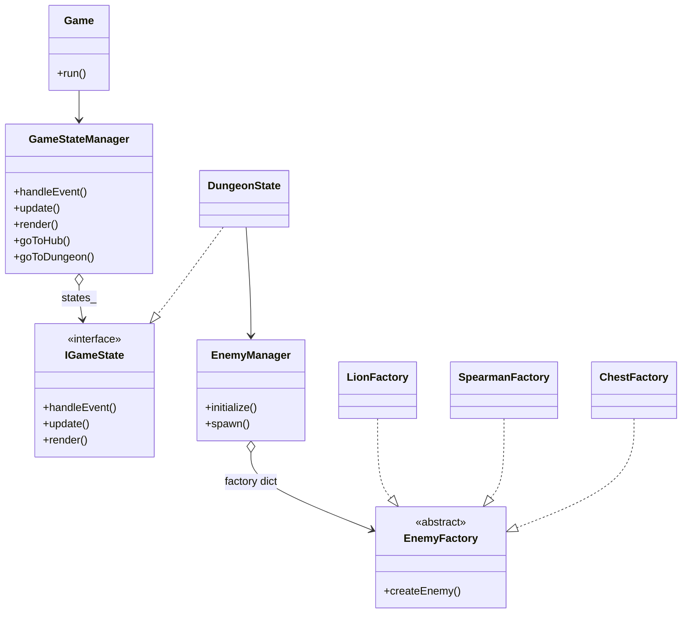

Резников Ярослав Алексеевич
Версия SFML: 3.0.2

Доп. механика 1- ритм: ввод действий в окне бита по BPM музыки (World.cpp)

Доп. механика 2- увеличение урона за серию попаданий: множитель урона за streak успешных действий (World.cpp)

Паттерны:
- Game Loop (core/Game.cpp) — основной цикл: обработка событий → update → render.
- State + менеджер состояний (core/GameStateManager.* + states/IGameState.h) — хранит стек/очередь `IGameState`, прокидывает `handleEvent/update/render`, переключает состояния (например, `DungeonState`).
- Factory Method / Abstract Factory (world/factory/EnemyFactory.h + world/EnemyManager.cpp + world/factory/*Factory.h) — создание разных типов врагов через общий интерфейс фабрики.

